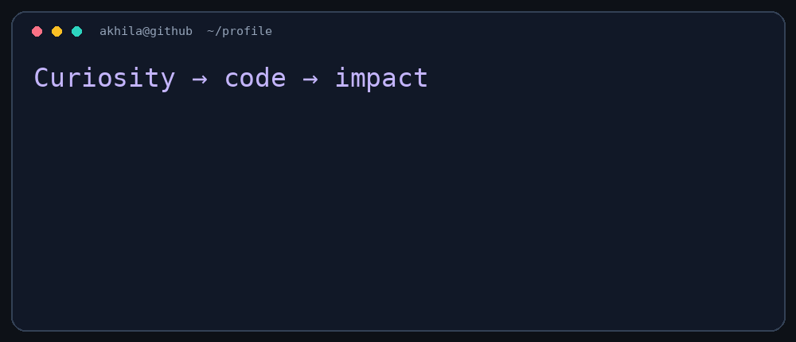

### Building useful software. Exploring intelligent systems.

[About](#about-me) · [Projects](#featured-projects) · [Stack](#tools-i-work-with) · [Activity](#coding-activity) · [Beyond code](#beyond-code)

## About me

I'm **Akhila Doddigarla**, an **AI & Data Science student at CBIT, Hyderabad (2023–2027)**. I enjoy connecting software development, machine learning, and security through practical projects.

- **Building:** authentication prototypes, web applications, and applied AI projects.
- **Learning:** C# / .NET, dynamic programming, and core computer science.
- **Interested in:** software engineering and AI / data science internship opportunities.
- **Outside the editor:** public speaking, event coordination, and bringing people together around technology.

## Featured projects

| Project | What it explores | Main tools |
| :--- | :--- | :--- |
| **CloudSentinel** | Context-aware authentication and behavioural anomaly detection | Python · Flask · Isolation Forest |
| **IIoT command authorization** | Hardware-backed transaction approval using visual cryptography | Raspberry Pi · MQTT · Flask |
| **[RoadCodeX](https://github.com/dakhila201105/RodeCODEX)** | Driving-school simulation in a 3D environment | Unity · C# |
| **[Construction Air Quality Monitor](https://github.com/dakhila201105/air_quality_construction)** | Applying AI to construction-site air quality monitoring | Python · Machine learning |

<b>🔐 Explore CloudSentinel</b> — authentication with context

A Flask-based zero-trust authentication prototype combining passwords, email OTP, device fingerprinting, risk scoring, and Isolation Forest anomaly detection. Contextual checks help decide whether to allow, deny, or send a request for administrator review.

**What I explored:** connecting ML output with application decisions, audit logging, and active-session monitoring.

<b>🏭 Explore IIoT authorization</b> — software meets hardware

A Raspberry Pi-based bank transaction approval prototype using visual cryptography shares and challenge-response verification. MQTT carries transaction-specific responses to the Flask server.

**What I explored:** hardware integration, nonce validation, device binding, and transaction-specific messaging.

<b>🚗 Explore RoadCodeX</b> — learning through simulation

A Unity 3D driving-school project focused on an interactive driving environment.

[Browse the repository →](https://github.com/dakhila201105/RodeCODEX)

<b>🌿 Explore air quality monitoring</b> — AI with an environmental purpose

Developed during my 1M1B internship, this project focuses on construction-site air quality, with fieldwork around Kokapet and exploration of monitoring, prediction, and mitigation guidance.

[Browse the repository →](https://github.com/dakhila201105/air_quality_construction)

## Tools I work with

| Area | Experience and focus |
| :--- | :--- |
| **Application development** | Python, Java, JavaScript, React, Flask, Spring Boot |
| **AI & data** | TensorFlow, scikit-learn, pandas, NumPy |
| **Security & hardware** | Visual cryptography, MQTT, Raspberry Pi, Wireshark, OWASP labs |
| **Currently learning** | C# / .NET, DSA and dynamic programming |

## Coding activity

[**My DSA practice repository →**](https://github.com/dakhila201105/LeetcodeDSA)

### My contribution city

<picture>
  <source media="(prefers-color-scheme: dark)" srcset="profile-3d-contrib/profile-night-rainbow.svg" />
  
</picture>

Generated daily by GitHub Actions. Contributions reflect GitHub's attribution rules; language cards describe repository composition.

## Beyond code

- **CyberFest 2026:** helped coordinate a cybersecurity and blockchain conclave with **500+ registrations**, connecting participants, speakers, judges, and partners.
- **1M1B internship:** explored construction-site air quality through project work and field visits.
- **Web development & cybersecurity internships:** built web fundamentals and practised security testing in learning environments.
- **Salesforce learning:** exploring Apex, platform development, and Agentforce through Trailhead.

<b>What I'm working toward</b>

Building stronger software fundamentals, improving my problem-solving consistency, and turning project prototypes into clearer, better-tested applications.

I'm happy to connect about software engineering, applied AI, cybersecurity, and student technology communities.

---

**Let's build something useful.**

[LinkedIn](https://www.linkedin.com/in/doddigarlaakhila) · [Email](mailto:ugs23078_aids.akhila@cbit.org.in) · [GitHub](https://github.com/dakhila201105)

